# iris-ng

> A community fork of [DFIR-IRIS](https://github.com/dfir-iris/iris-web) v2.5.0-beta.1,
> with native MISP integration, MISP nomenclature alignment, and an in-tree AI assistant
> layer. See [`FORK.md`](./FORK.md) for attribution + the rationale.

[](./LICENSE.txt)

A collaborative incident-response platform. Forked from DFIR-IRIS because upstream paused
feature development in late 2024 and stranded `v2.5.0-beta.1` in beta.

---

## What's new vs upstream

### Native MISP sync

Native MISP sync module (`source/iris_misp_sync_module/`) — case ↔ MISP event,
IOC ↔ MISP attribute, with the IOC's TLP driving distribution + tags.

MISP nomenclature alignment via `IocType.type_taxonomy` — IOC types map to MISP
attribute types, with an AI fallback for the few that don't have a direct match.
Each IOC carries a **MISP Report** tab showing its current sync state, and a
**Linked Notes** back-link recording where the IOC was sourced from.

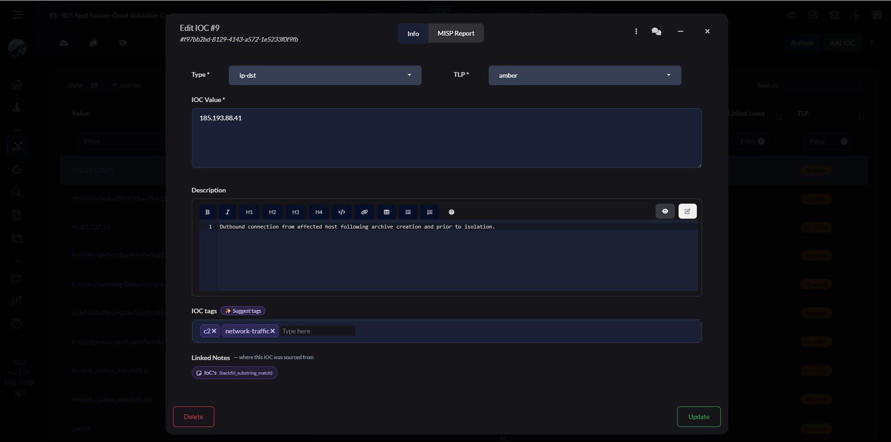

---

### AI assistant layer

In-tree AI assistant (`source/app/iris_engine/ai/`) across the full case lifecycle:

#### Executive case summary

Multi-pass map-reduce summary panel — handles large cases without blowing past
local-model context windows. Cached per content hash, stamped with model, prompt
version, and generation timestamp.

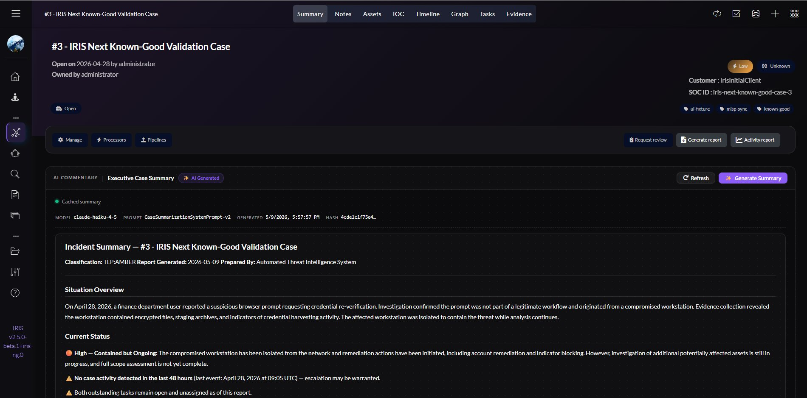

#### Case-scoped chat on six tabs

Chat assistant scoped to the active case-detail tab (Notes / Timeline / Assets /
IOC / Tasks / Evidence) with per-tab specialized prompts. On the Notes tab the
assistant cross-references timeline, IOCs, and assets when needed.

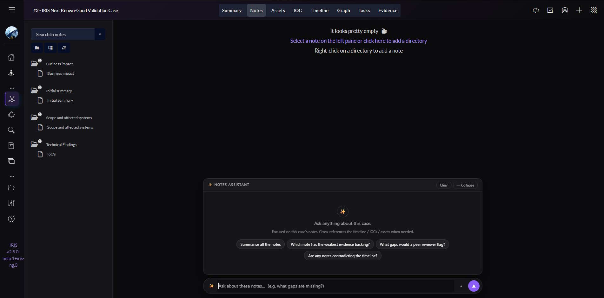

#### Timeline analysis

Full-width timeline analysis panel that summarises what the timeline tells us,
what remains uncertain, and where to dig next — generated across all visible events.

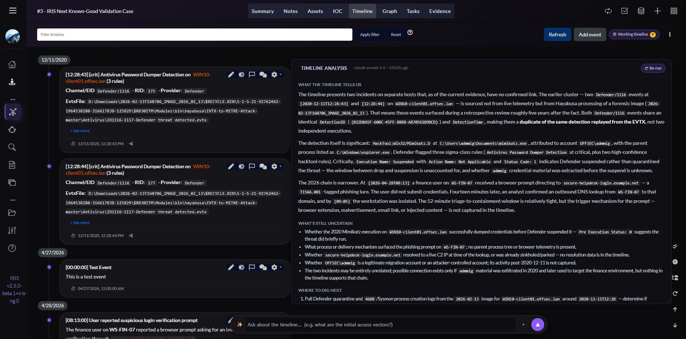

#### Per-event AI analysis

Right-drawer AI analysis on any timeline event: what the event implies, suggested
ATT&CK mappings with confidence ratings, and related events already in the case.

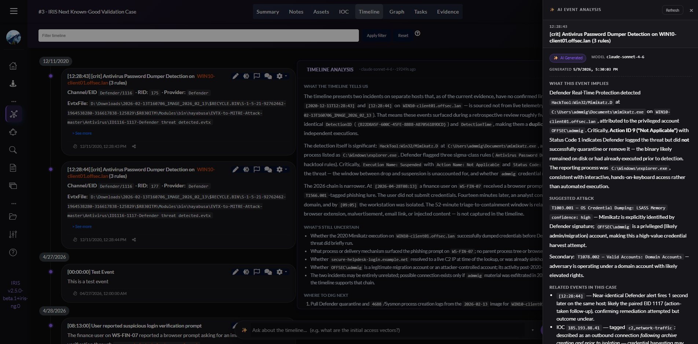

#### ATT&CK + Unified Kill Chain suggestions

MITRE ATT&CK and Unified Kill Chain v1.3 phase suggestions on event create/edit.
Events in the working timeline carry technique tags and per-event **Promote** /
**Reject** / **Explain** actions for inline triage.

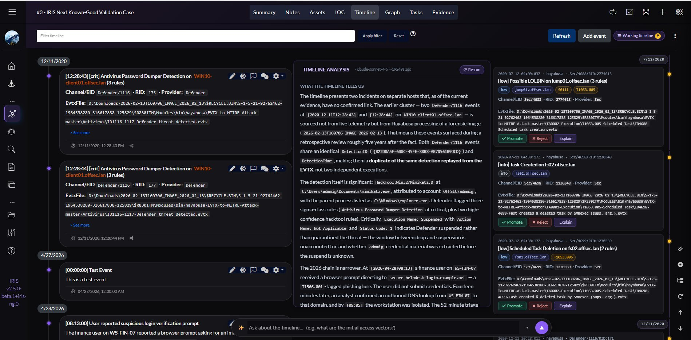

The **Explain** button expands an inline AI panel describing what the detection
covers, what likely happened based on the log data, and a concrete triage hint.

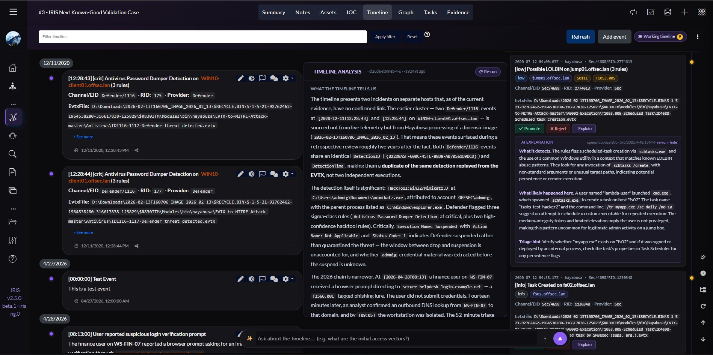

#### Other AI surfaces

- IOC extraction from note text with type validation + noise-flag affordance.
- AI-suggested evidence type on upload (auto-fires from filename + magic bytes).
- AI-suggested case template on alert escalation.

---

### Asset ↔ Evidence linking + IOC ↔ Note provenance

Asset-to-Evidence linking and IOC-to-Note provenance back-links — pairs the
existing IOC ↔ Asset relationship. All three relationship directions are navigable
from asset, evidence, and IOC records.

**Assets table** — compromise status, linked IOCs, and tags visible at a glance:

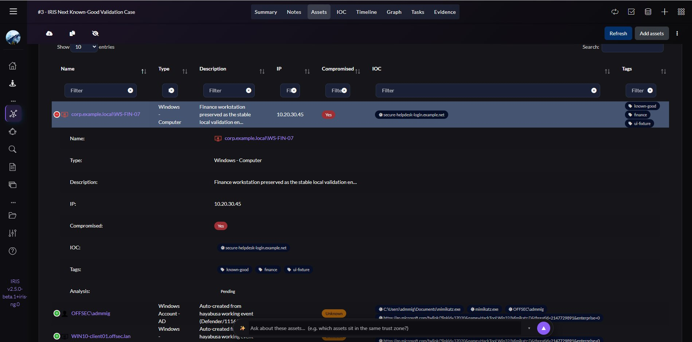

**Asset editor** — linked IOC and linked evidence item both visible and navigable
from the same record:

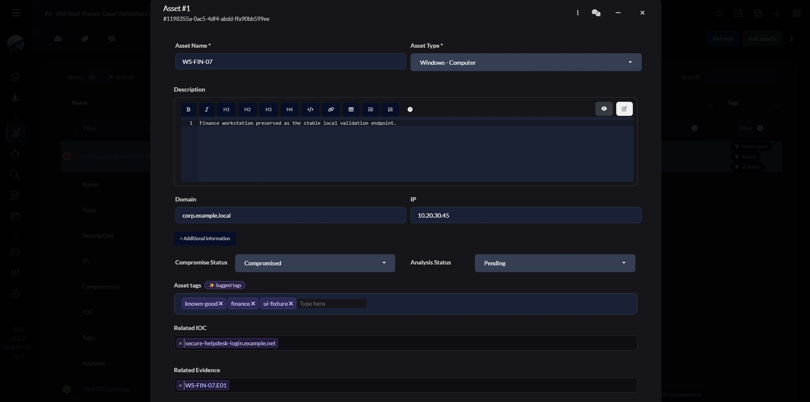

**Evidence editor** — Linked Assets field records which asset the evidence
pertains to; hash, size, and type captured for chain-of-custody:

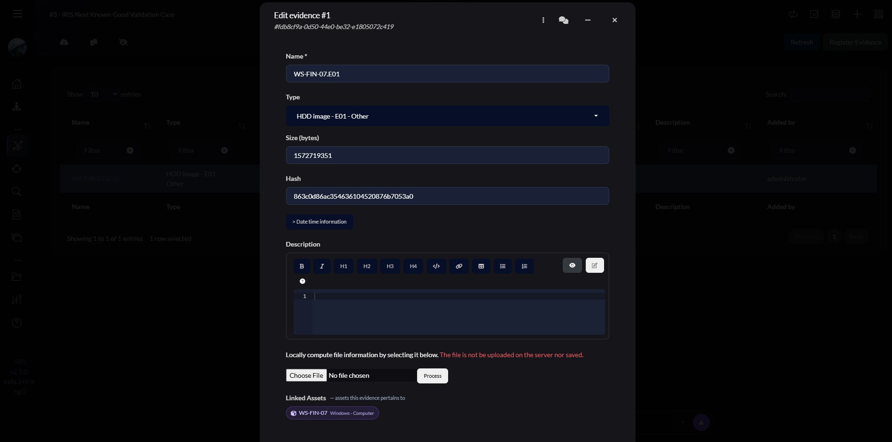

---

### Jira-style task linking

`blocks` / `is blocked by`, `depends_on` / `is depended on by` — with advisory
cycle-detection warnings. Dependency status (Done / In progress / etc.) is visible
inline on the linked task chip.

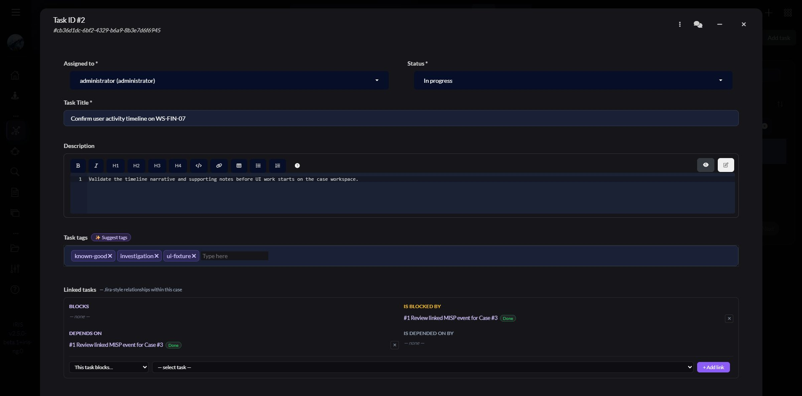

---

### Admin-editable AI backend settings

AI backend URL / API key / model / confidence threshold are configurable from the
UI at `/manage/settings` rather than env-only. No rebuild required to switch models
or point at a different endpoint.

---

## Run it

```bash
# 1. Clone
git clone https://github.com/zach115th/iris-ng.git
cd iris-ng

# 2. Generate self-signed dev certs for nginx
bash scripts/generate_dev_certs.sh

# 3. Bootstrap .env, build, and start the stack (one-shot)
bash scripts/iris_helper.sh --init
```

`--init` writes `.env` with fresh random secrets, builds the dev stack from
the in-tree Dockerfiles, and starts everything in daemon mode. If you'd rather
manage the stack yourself, skip `--init` and run
`docker compose -f docker-compose.dev.yml up -d --build` directly after
generating an `.env` from `.env.model`.

UI on `https://localhost` (HTTPS, port 443). The browser will warn about the self-signed
cert on first visit — accept the warning (`Advanced` → `Proceed`).

The first-boot admin username is `administrator`. Get the generated password from logs:

```bash
docker compose -f docker-compose.dev.yml logs app | grep "Administrator password"
```

Or seed it via `IRIS_ADM_PASSWORD` in `.env` before the first start.

### Optional features

- **MISP sync** — set `MISP_URL` and `MISP_API_KEY` in `.env`, then enable the
  `iris_misp_sync` module under `/manage/modules` after first boot.
- **AI assistant** — configure backend URL / API key / model under `/manage/settings`
  (defaults work with a local LM Studio at `http://<lm-studio-host>:1234/v1`). The
  free `openai/gpt-oss-20b` model is what the AI surfaces are tuned against.

---

## Stack

Five containers: `app` (Flask + SocketIO + Celery), `db` (PostgreSQL), `rabbitmq`,
`worker` (Celery worker), `nginx`. See [`architecture.md`](./architecture.md) for the
layered code design (blueprints → business → datamgmt; cross-layer imports forbidden).

---

## Branches

- `main` — primary branch.
- `develop` — active work; feature commits land here before merging to `main`.
- `upstream-fixes` — created lazily if upstream ships a bugfix worth cherry-picking.

---

## Commit conventions

Inherited from upstream (`CODESTYLE.md`):

- `[ADD]` / `[FIX]` / `[IMP]` / `[DEL]` action prefix.
- With issue: `[#123][FIX] message`.
- Python: f-strings only, one import per line, function names include the module name
  (e.g. `iocs_create`).
- DB schema changes ship an Alembic migration. Define `CHECK` constraints on the ORM
  model's `__table_args__` (not just in the migration) — IRIS runs `db.create_all()`
  before alembic, so migration-only constraints are dropped.

---

## License

LGPL-3.0. See [`LICENSE.txt`](./LICENSE.txt). Modifications must remain LGPL.

## Acknowledgements

DFIR-IRIS by Airbus CyberSecurity (SAS) and the open-source community. Original repo at
<https://github.com/dfir-iris/iris-web>. Sponsored historically by Deutsche Telekom
Security GmbH.
